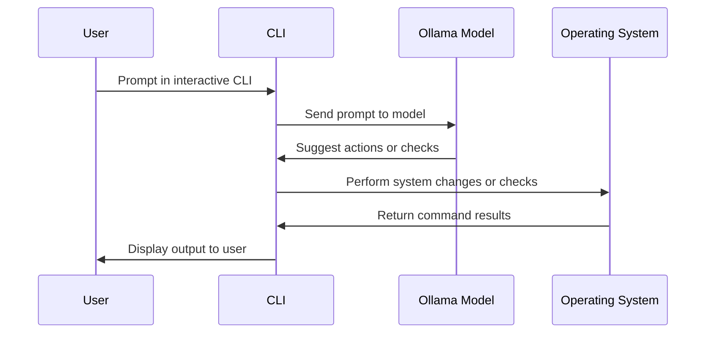

# os-bot Workflow

The diagram below illustrates how `os-bot` operates when using interactive mode with models served by Ollama.

In this workflow, the user interacts with the command-line interface, which communicates with a model served by Ollama. The model suggests tasks to perform on the operating system, and the CLI executes them, displaying any results back to the user.
